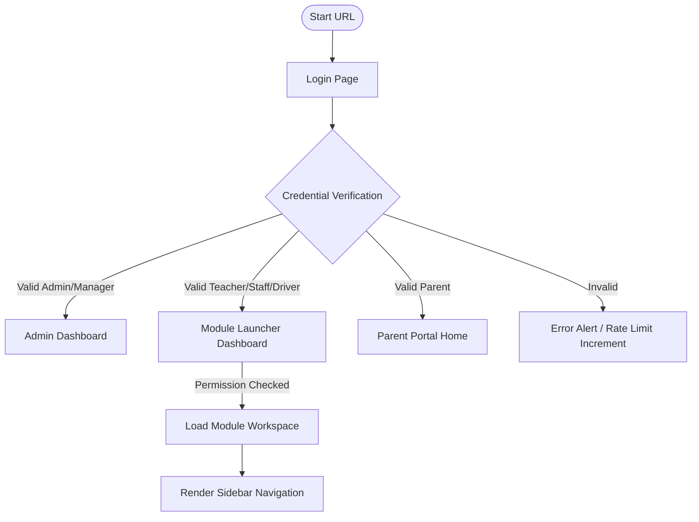
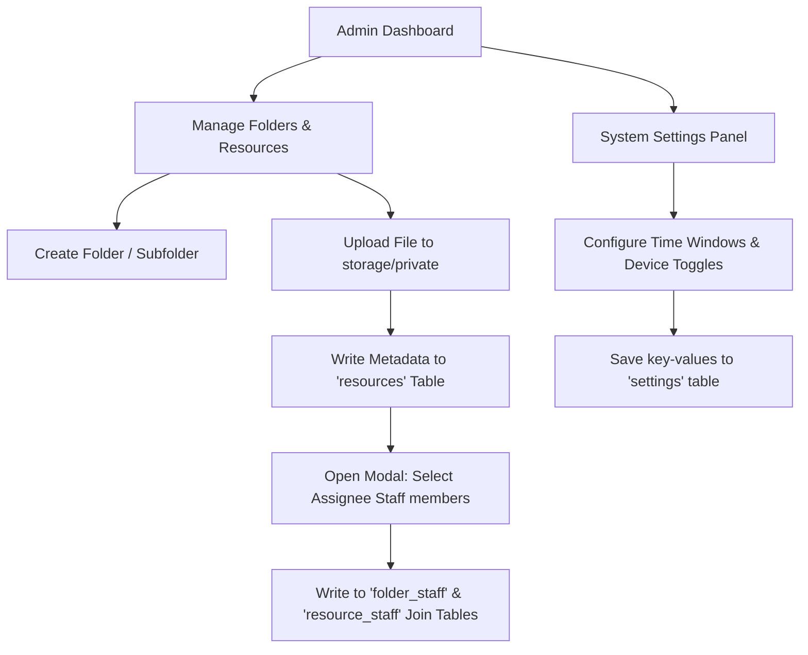
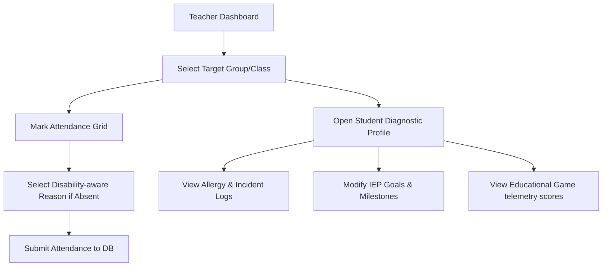
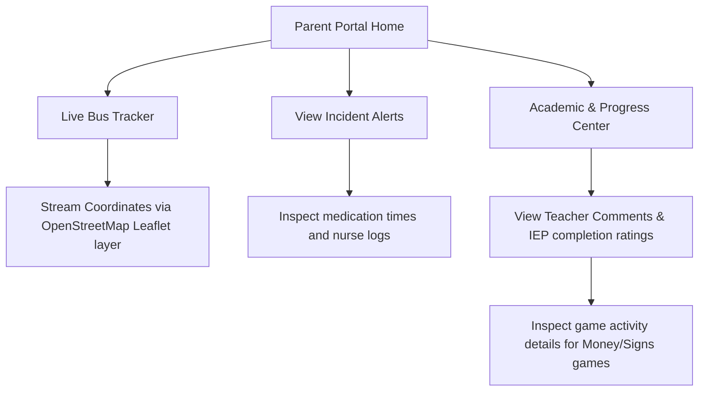
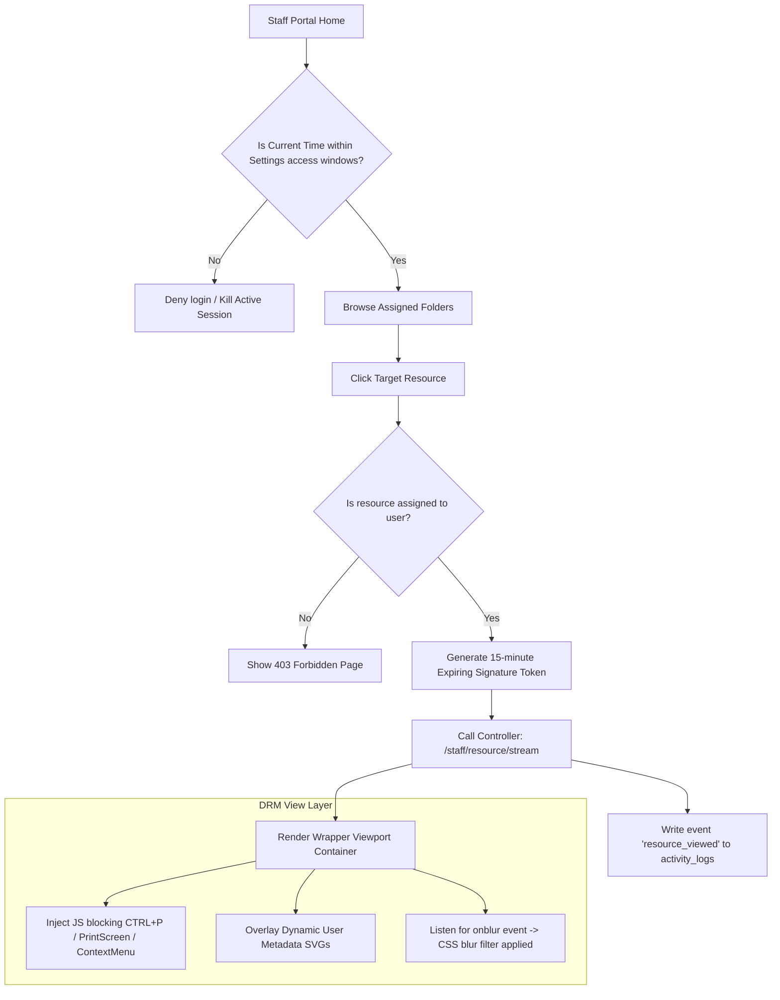

# Application Flow & Navigation Maps

This document maps user paths, screen states, and logical redirects for key workflows using Mermaid flowcharts.

---

## 1. Global Navigation Architecture

The entry points and high-level routing flow for all user roles:

---

## 2. Admin Workspace Workflow (Folder & Resource Management)

How the administrator assigns materials and secures the platform:

---

## 3. Teacher/Therapist Workflow (IEP & Class Logging)

The daily work loop for special education educators:

---

## 4. Parent Portal Flow

How parents interact with transportation tracking, medical logs, and progress reports:

---

## 5. Staff DRM Flow (Secure Material Review)

The secure loop enforcing viewing blocks and activity auditing:

