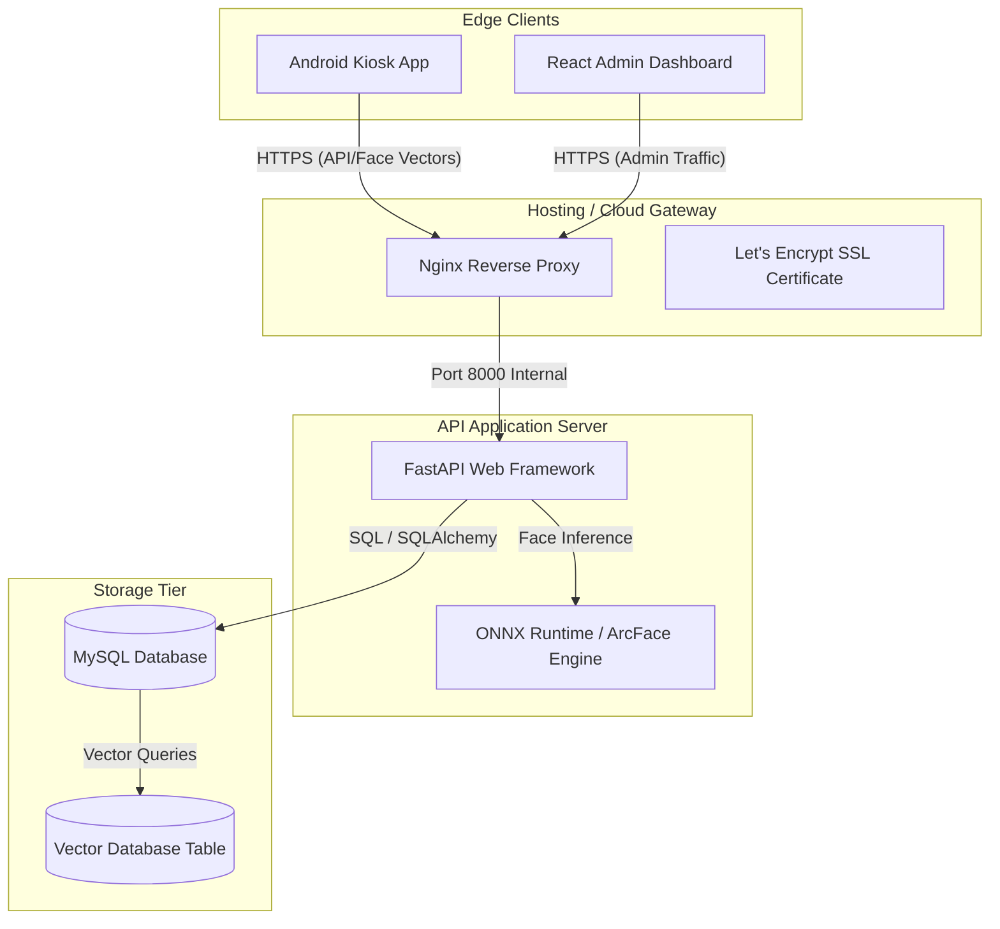
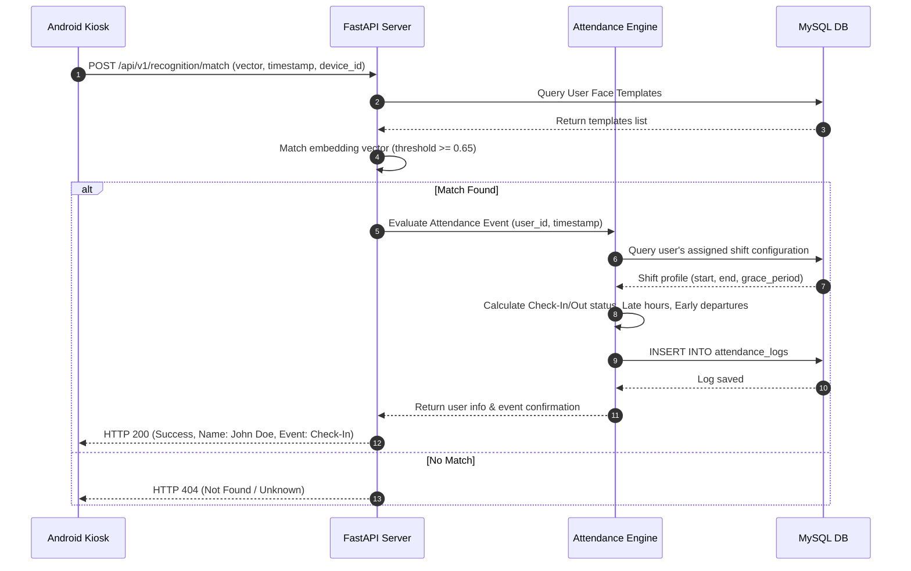

# System Architecture Specification

This document details the architectural design, communication protocols, and data flows of the **AI Face Recognition Attendance System**.

---

## 1. High-Level System Architecture

The system utilizes a client-server architecture split into three main logical tiers:
1. **Edge Clients**: Android kiosk devices (for real-time face capturing, tracking, and local verification) and React Web Clients (for administrative tasks).
2. **Infrastructure Reverse Proxy**: Nginx router handling traffic routing, SSL certificates, and static web page hosting.
3. **Application & Storage Backend**: FastAPI application server processing deep-learning inferences (using ONNX Runtime), relational data management, and task automation.



---

## 2. Component Architecture

### A. Android Client Application (Clean Architecture + MVVM)
The Android client utilizes a decoupled layers approach to separate concerns and support testing:

```
┌────────────────────────────────────────────────────────────────────────┐
│                              ANDROID APP                               │
├───────────────────────┬──────────────────────┬─────────────────────────┤
│    UI Layer (M3)      │    Domain Layer      │      Data Layer         │
│                       │                      │                         │
│ • Activities/Fragments│ • Use Cases          │ • Room DB Cache         │
│ • ViewModels          │ • Domain Entities    │ • Retrofit REST Client  │
│ • StateFlow Observers │ • Business Rules     │ • CameraX Frame Capture │
└───────────────────────┴──────────────────────┴─────────────────────────┘
```

* **Data Layer**: CameraX pipelines, Room local databases, and Retrofit network instances.
* **Domain Layer**: Abstract repository definitions, interface models, and core verification rules.
* **UI Presentation Layer**: Jetpack Material Design 3 screens, ViewModels maintaining state, and lifecycle observers.

### B. FastAPI Application Server (Asynchronous Monolith)
The backend is structured as an asynchronous monolith to simplify maintenance for the target organization size (20–50 employees, scaling to hundreds), while remaining clean and modular:
* **API Routers**: Expose routes divided by functional components (e.g., `/auth`, `/employees`, `/attendance`, `/recognition`).
* **Service Layer**: Contains business rules, including the Attendance Engine, Shift Scheduler, and Report Generator.
* **Core AI Inference Engine**: A thread-pooled execution unit wrapper for OpenCV operations, liveness scoring, and ONNX-based model inference.
* **Data Access Layer**: Repository patterns using SQLAlchemy asynchronous sessions.

---

## 3. Core Data Flow & Pipelines

### A. Real-Time Face Verification Pipeline
When an employee stands in front of the kiosk, their face image passes through several steps before recording attendance:

```mermaid
flowchart TD
    Start([Frame Captured from CameraX]) --> Detection[RetinaFace Face Detection]
    Detection --> Alignment[Face Landmark Alignment]
    Alignment --> Liveness[Anti-Spoofing & Liveness Validation]
    
    Liveness -->|Failed| AlertSpoof[Display Spoofing Error]
    Liveness -->|Passed| GenEmbedding[Extract 512-dim ArcFace Embedding]
    
    GenEmbedding --> Matching{Vector Match Pipeline}
    
    Matching -->|Offline Mode / Local Cache| RoomDB[(Room SQLite DB)]
    Matching -->|Online Mode / API| APIReq[POST /recognition/match]
    
    RoomDB --> MatchResult{Match Found?}
    APIReq --> MatchResult
    
    MatchResult -->|No Match / Unknown| DisplayUnknown[Display "Unknown Person" Alert]
    MatchResult -->|Match Found| DuplicateCheck{Duplicate Cooldown Check}
    
    DuplicateCheck -->|Inside Cooldown| IgnoreEvent[Ignore Frame]
    DuplicateCheck -->|Outside Cooldown| SaveLog[Log Attendance / Voice Success]
```

### B. Daily Attendance Log Pipeline
This sequence diagram shows how a verification event is processed by the database and shift engine:



---

## 4. Communication Interface & Protocol Standards

All network communication between client apps and the backend uses the following standards:

### Data Serialization
* All network payloads use standard JSON format with a UTF-8 character encoding set.
* Raw face embeddings are transmitted as a flat JSON array of 512 floating-point values: `[0.0124, -0.0543, ..., 0.1293]`.

### Security Protocols
* **TLS 1.3**: All external network traffic must use HTTPS, secured with modern TLS cipher suites.
* **Authentication Header**: Android and Dashboard requests authenticate using bearer tokens:
  ```http
  Authorization: Bearer <JWT_TOKEN_HERE>
  ```

For the structure of directories and code files supporting this architecture, refer to [FOLDER_STRUCTURE.md](FOLDER_STRUCTURE.md).
