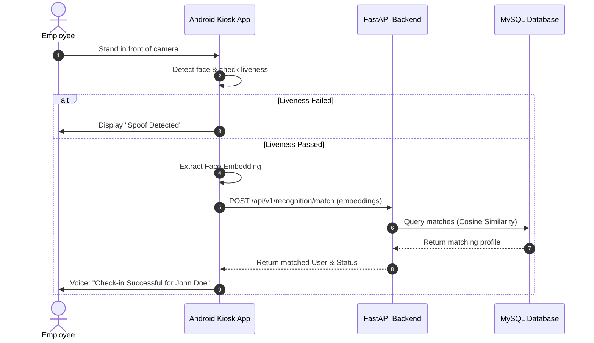

# Project Overview: AI Face Recognition Attendance System

## 1. Executive Summary

The **AI Face Recognition Attendance System** is designed to replace outdated, manual, or contact-based biometric logging hardware (such as fingerprint scanners and RFID cards) with a fully automated, tablet/phone-mounted kiosk application and a centralized management platform. 

### Core Purpose
* **Seamless & Contactless**: Zero physical contact is required. Employees walk up to a wall-mounted Android tablet, which instantly detects, tracks, and verifies their identity in real-time, logging their timestamps with absolute accuracy.
* **Cost-Efficient**: Operates on off-the-shelf consumer Android hardware, removing the need for dedicated proprietary biometric hardware.
* **Anti-Spoofing & Security**: Features liveness detection algorithms to block attempts to bypass checks using photographs or high-definition screen replays.
* **Scalable Architecture**: Tailored for companies with 20–50 employees initially, but architected with high-concurrency database schemas and optimized vector search vectors to easily support hundreds or thousands of profiles across multiple branches.

---

## 2. Business Rules & Scope

The system executes core operations based on a set of fundamental business rules:

### A. Attendance Rules
1. **The Day-Boundary Rule**: A standard attendance cycle corresponds to a 24-hour block, but supports shifts extending past midnight.
2. **Duplicate Prevention (Double Clock-in Guard)**: To prevent accidental double logs when an employee lingers near the device, a configurable cooldown interval (e.g., 5 minutes) is enforced immediately after a successful scan.
3. **Automatic Check-in vs. Check-out**: The system identifies check-in/out based on the employee's shift definition, matching the clock event to the closest expected schedule checkpoint. If an employee clocks twice within their shift window, the first is marked as `CHECK_IN` and the last is marked as `CHECK_OUT`.
4. **Exceptions & Classifications**:
   * **Late Arrival**: Calculated relative to the shift start time plus a configurable grace period (e.g., 10 minutes).
   * **Early Leave**: Triggered when the check-out occurs before the configured shift end time.
   * **Half-Day**: Triggered if total hours worked fall below a set threshold (e.g., 4 hours).
   * **Overtime (OT)**: Registered automatically if the employee clocks out after their shift end and surpasses a minimum overtime threshold (e.g., 30 minutes).

### B. Scalability Limits
* **Local Processing Target**: Up to 500 face representations cached locally on the client Android tablet for ultra-fast offline/disconnected verification.
* **Backend Capacity**: Designed to query up to 10,000 face embedding vectors using cosine similarity without noticeable latency (less than 150ms query response time).

---

## 3. System User Personas

The system categorizes interactions into four main roles:

```
┌─────────────────────────────────────────────────────────────────────────┐
│                               USER ROLES                                │
├─────────────────┬──────────────────┬─────────────────┬──────────────────┤
│    Super Admin  │    Org Admin     │  Kiosk Tablet   │     Employee     │
│                 │                  │                 │                  │
│ • System Setup  │ • Manage Staff   │ • Camera Stream │ • Check-in/Out   │
│ • Database Sync │ • Shift Configs  │ • Liveness Det. │ • Voice Prompts  │
│ • Global Config │ • Reports/Alerts │ • Local Cache   │ • Verification   │
└─────────────────┴──────────────────┴─────────────────┴──────────────────┘
```

### I. Employee
* **Goal**: Clock in/out quickly without manual interaction.
* **Key Workflows**:
  * Complete a one-time multi-angle face enrollment guided by the Admin dashboard or Android enrollment mode.
  * Stand in front of the kiosk to register daily attendance.
  * Listen to audio/visual confirmations ("Welcome [Name]! Check-in successful").

### II. Kiosk Tablet (Device Profile)
* **Goal**: Provide continuous live stream capture, execute face tracking/liveness checks, and synchronize events with the backend.
* **Key Workflows**:
  * Execute background face tracking on frame cycles.
  * Perform liveness verification.
  * Query local SQLite cache for fast matching; fallback to backend API when offline queue is processed.

### III. Organization Administrator (Admin)
* **Goal**: Manage employee rosters, configure shifts, verify report logs, and correct anomalies.
* **Key Workflows**:
  * Enroll new employees and manage demographic metadata.
  * Designate shift templates and assign them to employees or departments.
  * Manage manual attendance corrections (e.g., if an employee forgot to clock out).
  * Export attendance statistics to Excel, CSV, or PDF formats.

### IV. Super Administrator
* **Goal**: Perform global operations across multiple clients, configure system-wide thresholds, check audits, and manage database backups.
* **Key Workflows**:
  * Review audit logs to track changes made by admins.
  * Configure system-wide face matching thresholds.
  * Trigger database backup and recovery scripts.

---

## 4. High-Level System Workflow



For a deeper dive into the technological selections and exact architectural boundaries, see [TECH_STACK.md](TECH_STACK.md) and [ARCHITECTURE.md](ARCHITECTURE.md).
