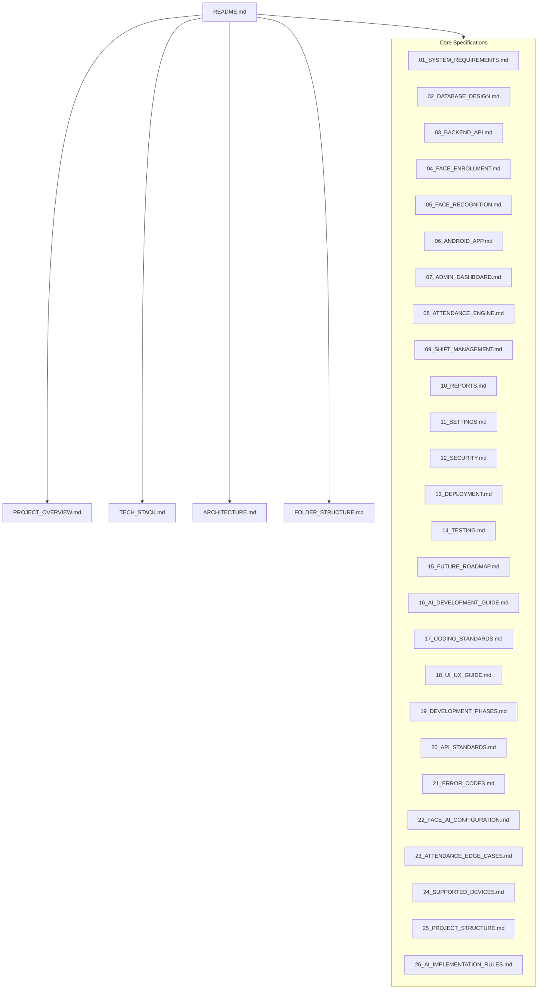

# AI Face Recognition Attendance System

An enterprise-grade, high-performance, and secure face recognition-based attendance tracking system designed to replace traditional biometric hardware with standard Android devices.

---

## 📌 Project Overview

Traditional biometric systems (fingerprint, card swipe) require specialized hardware, cause physical contact bottlenecks, and are prone to proxy attendance or physical wear. The **AI Face Recognition Attendance System** utilizes low-cost, off-the-shelf Android tablets/phones deployed at entry/exit points, connected to a robust, containerized Python/FastAPI backend using state-of-the-art deep learning architectures (InsightFace & ArcFace) for instant, contact-free verification.

This repository contains the complete software specification, architectural blueprint, database design, API definitions, UI layout configurations, and deployment procedures.

---

## 🛠️ Technology Stack

| Component | Technology | Version | Purpose |
| :--- | :--- | :--- | :--- |
| **Backend Framework** | FastAPI (Python) | `3.12` / `0.111+` | High-performance asynchronous API services |
| **Database** | MySQL | `8.0` | Relational storage for users, schedules, logs |
| **ORM & Migrations** | SQLAlchemy & Alembic | Latest | Database abstractions and versioning |
| **AI Inference** | InsightFace / ONNX Runtime | Latest / `1.18.0` | Face detection, alignment, and embedding extraction |
| **Android Client** | Kotlin / CameraX / MVVM | `1.9+` | Native tablet/mobile kiosk interface |
| **Admin Dashboard** | React / Vite / Material UI | `18.x` / `5.x` | Web dashboard for administration and reporting |
| **Containerization** | Docker & Docker Compose | Latest | Standardized deployment and environment parity |
| **Web Server** | Nginx | Latest | Reverse proxy, HTTPS termination, static hosting |

---

## 📂 Documentation Directory Map

This documentation is split into multiple modules to provide exhaustive specifications for every component.



### 📖 Documentation Index

1. **Project Initiation & Architecture**
   * [PROJECT_OVERVIEW.md](PROJECT_OVERVIEW.md) — Product vision, business rules, target audience, and key features.
   * [TECH_STACK.md](TECH_STACK.md) — Selection rationale, libraries, models, framework versions, and hardware targets.
   * [ARCHITECTURE.md](ARCHITECTURE.md) — Data flow, MVVM implementation, sequence diagrams, and systems integration.
   * [FOLDER_STRUCTURE.md](FOLDER_STRUCTURE.md) — Complete folder tree for Backend, Frontend, Android, and DevOps configurations.

2. **System Design Specifications**
   * [01_SYSTEM_REQUIREMENTS.md](docs/01_SYSTEM_REQUIREMENTS.md) — Detailed functional and non-functional requirements.
   * [02_DATABASE_DESIGN.md](docs/02_DATABASE_DESIGN.md) — Relational schema (ERDs), indexes, migrations, and constraint matrices.
   * [03_BACKEND_API.md](docs/03_BACKEND_API.md) — RESTful API contract, Swagger endpoints, request/response models, and rate limits.

3. **Face AI & Recognition Core**
   * [04_FACE_ENROLLMENT.md](docs/04_FACE_ENROLLMENT.md) — Kiosk guidance, anti-blur, frame selection, and embedding generation.
   * [05_FACE_RECOGNITION.md](docs/05_FACE_RECOGNITION.md) — Real-time frame pipeline, face tracking, liveness detection, and matching algorithms.
   * [22_FACE_AI_CONFIGURATION.md](docs/22_FACE_AI_CONFIGURATION.md) — Custom thresholds, pose limits, and ONNX Runtime performance tuning.

4. **Client-Side Applications**
   * [06_ANDROID_APP.md](docs/06_ANDROID_APP.md) — CameraX integration, SQLite offline synchronization, kiosk mode, and screen mockups.
   * [07_ADMIN_DASHBOARD.md](docs/07_ADMIN_DASHBOARD.md) — Admin panels, charts, employee configurations, status overrides, and settings screens.
   * [18_UI_UX_GUIDE.md](docs/18_UI_UX_GUIDE.md) — Design tokens, Material Design 3 configurations, and layout spacing systems.

5. **Business Logic & Rules Engine**
   * [08_ATTENDANCE_ENGINE.md](docs/08_ATTENDANCE_ENGINE.md) — Work hours calculation, early leaves, late arrivals, and duplicate prevention.
   * [09_SHIFT_MANAGEMENT.md](docs/09_SHIFT_MANAGEMENT.md) — Multi-shift rotation, grace periods, holidays, and overtime parameters.
   * [10_REPORTS.md](docs/10_REPORTS.md) — Daily, weekly, monthly aggregation engines and export configurations (CSV, Excel, PDF).
   * [23_ATTENDANCE_EDGE_CASES.md](docs/23_ATTENDANCE_EDGE_CASES.md) — Solutions handbook for scanning failures, twins, and connectivity outages.

6. **Operations, Settings & Compliance**
   * [11_SETTINGS.md](docs/11_SETTINGS.md) — Threshold configurations, voice prompts, network behaviors, and backup systems.
   * [12_SECURITY.md](docs/12_SECURITY.md) — Encryption rules, JWT storage, face embedding protection, and logging.
   * [13_DEPLOYMENT.md](docs/13_DEPLOYMENT.md) — Production playbook (Ubuntu VPS, Docker Compose, Nginx, SSL, Firewall).
   * [14_TESTING.md](docs/14_TESTING.md) — Verification methods, performance criteria, mock testing, and accuracy matrix.
   * [24_SUPPORTED_DEVICES.md](docs/24_SUPPORTED_DEVICES.md) — Kiosk hardware recommendations, camera targets, and hosting sizing tiers.

7. **Strategic Evolution & AI Prompts**
   * [15_FUTURE_ROADMAP.md](docs/15_FUTURE_ROADMAP.md) — Multi-device synchronization, payroll integration, visitor tracking, and scale goals.
   * [16_AI_DEVELOPMENT_GUIDE.md](docs/16_AI_DEVELOPMENT_GUIDE.md) — Framework and prompt execution parameters.
   * [19_DEVELOPMENT_PHASES.md](docs/19_DEVELOPMENT_PHASES.md) — Detailed implementation phases (1 to 10) roadmap.
   * [20_API_STANDARDS.md](docs/20_API_STANDARDS.md) — RESTful envelope standard and rate-limiting limits.
   * [21_ERROR_CODES.md](docs/21_ERROR_CODES.md) — HTTP error catalog mapping client actions.
   * [25_PROJECT_STRUCTURE.md](docs/25_PROJECT_STRUCTURE.md) — Modular directory tree structure mapping.
   * [26_AI_IMPLEMENTATION_RULES.md](docs/26_AI_IMPLEMENTATION_RULES.md) — Standardized implementation instructions for AI models.
   * [prompts/](prompts/) — Specific prompts (`backend.md`, `android.md`, `database.md`, `dashboard.md`, `face-ai.md`, `deployment.md`) for independent AI implementation.

---

## ⚡ Quick Start (High-Level Development Workflow)

To set up the development environment locally:

1. **Clone the repository**:
   ```bash
   git clone <repository_url>
   cd facerecognization
   ```

2. **Backend Setup**:
   ```bash
   cd backend
   python -m venv venv
   source venv/bin/activate  # On Windows: .\venv\Scripts\activate
   pip install -r requirements.txt
   docker compose -f docker-compose.dev.yml up -d
   alembic upgrade head
   uvicorn app.main:app --reload
   ```

3. **Dashboard Setup**:
   ```bash
   cd dashboard
   npm install
   npm run dev
   ```

4. **Android Setup**:
   * Open `android/` directory in Android Studio.
   * Sync Gradle, compile, and run on a target device with Camera API 21+ support.

For comprehensive details on setting up individual services, refer to [13_DEPLOYMENT.md](docs/13_DEPLOYMENT.md) and [16_AI_DEVELOPMENT_GUIDE.md](docs/16_AI_DEVELOPMENT_GUIDE.md).
