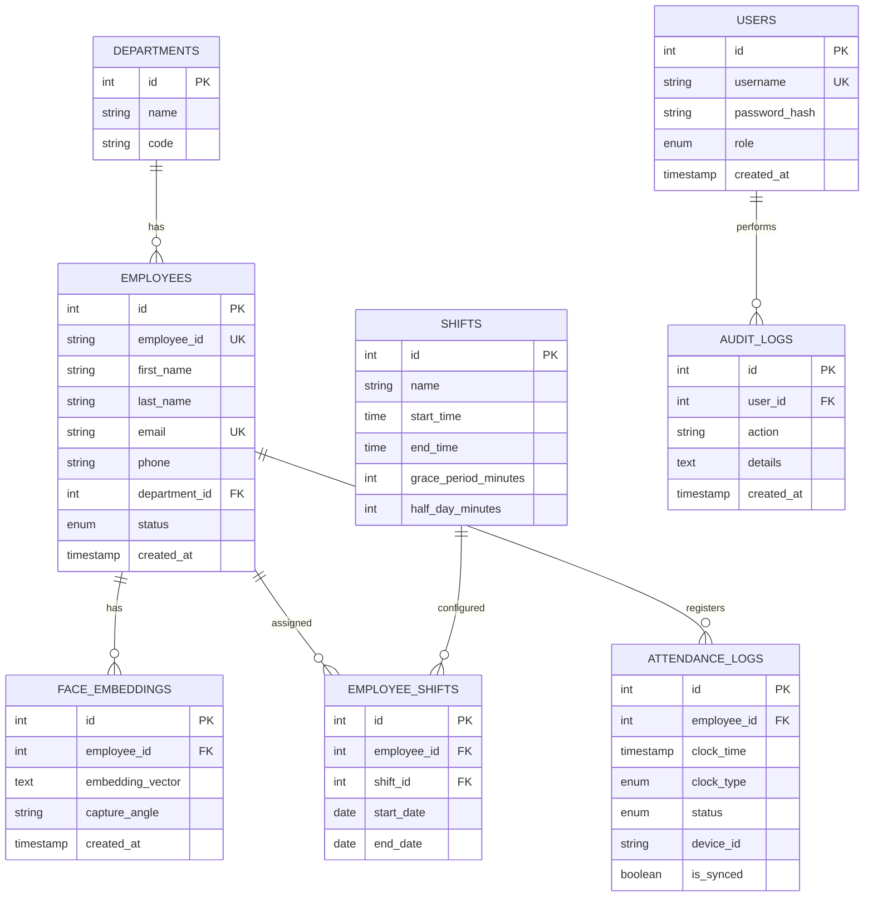

# Database Design Specification

This document defines the relational database schema, database tables, indexes, constraints, and migration strategies for the **AI Face Recognition Attendance System**.

---

## 1. Entity-Relationship Diagram (ERD)



---

## 2. Table Definitions & Constraints

### 2.1 Table: `departments`
Stores company departments.

| Column Name | Data Type | Nullable | Key | Default | Description |
| :--- | :--- | :--- | :--- | :--- | :--- |
| `id` | INT | NO | PK | Auto-increment | Unique identifier |
| `name` | VARCHAR(100) | NO | | | Department name |
| `code` | VARCHAR(10) | NO | UK | | Short code (e.g., ENG, HR) |

### 2.2 Table: `employees`
Stores employee profiles and metadata.

| Column Name | Data Type | Nullable | Key | Default | Description |
| :--- | :--- | :--- | :--- | :--- | :--- |
| `id` | INT | NO | PK | Auto-increment | Internal identifier |
| `employee_id` | VARCHAR(50) | NO | UK | | Company ID (e.g., EMP001) |
| `first_name` | VARCHAR(100) | NO | | | |
| `last_name` | VARCHAR(100) | NO | | | |
| `email` | VARCHAR(255) | NO | UK | | |
| `phone` | VARCHAR(20) | YES | | | |
| `department_id` | INT | YES | FK | NULL | Ref: `departments.id` |
| `status` | ENUM('ACTIVE', 'SUSPENDED', 'TERMINATED') | NO | | 'ACTIVE' | Employee state |
| `created_at` | TIMESTAMP | NO | | CURRENT_TIMESTAMP | |

### 2.3 Table: `face_embeddings`
Stores facial embedding vectors.

| Column Name | Data Type | Nullable | Key | Default | Description |
| :--- | :--- | :--- | :--- | :--- | :--- |
| `id` | INT | NO | PK | Auto-increment | |
| `employee_id` | INT | NO | FK | | Ref: `employees.id` (ON DELETE CASCADE) |
| `embedding_vector` | TEXT | NO | | | JSON array containing 512 floats |
| `capture_angle` | VARCHAR(30) | NO | | | Direction (STRAIGHT, LEFT, etc.) |
| `created_at` | TIMESTAMP | NO | | CURRENT_TIMESTAMP | |

### 2.4 Table: `shifts`
Defines operational shift schedules.

| Column Name | Data Type | Nullable | Key | Default | Description |
| :--- | :--- | :--- | :--- | :--- | :--- |
| `id` | INT | NO | PK | Auto-increment | |
| `name` | VARCHAR(50) | NO | | | Shift name (e.g., Morning Shift) |
| `start_time` | TIME | NO | | | Shift start boundary |
| `end_time` | TIME | NO | | | Shift end boundary |
| `grace_period_minutes` | INT | NO | | 15 | Late arrival tolerance |
| `half_day_minutes` | INT | NO | | 240 | Minimum hours for half-day status |

### 2.5 Table: `employee_shifts`
Maps employees to shifts over specific date ranges.

| Column Name | Data Type | Nullable | Key | Default | Description |
| :--- | :--- | :--- | :--- | :--- | :--- |
| `id` | INT | NO | PK | Auto-increment | |
| `employee_id` | INT | NO | FK | | Ref: `employees.id` |
| `shift_id` | INT | NO | FK | | Ref: `shifts.id` |
| `start_date` | DATE | NO | | | Effective start date |
| `end_date` | DATE | YES | | NULL | End date (null if active indefinitely) |

### 2.6 Table: `attendance_logs`
Logs check-in and check-out events.

| Column Name | Data Type | Nullable | Key | Default | Description |
| :--- | :--- | :--- | :--- | :--- | :--- |
| `id` | INT | NO | PK | Auto-increment | |
| `employee_id` | INT | NO | FK | | Ref: `employees.id` |
| `clock_time` | TIMESTAMP | NO | | | Device capture timestamp |
| `clock_type` | ENUM('CHECK_IN', 'CHECK_OUT') | NO | | | Direction category |
| `status` | ENUM('PRESENT', 'LATE', 'EARLY_LEAVE', 'OVERTIME', 'REGULAR') | NO | | 'REGULAR' | Attendance status |
| `device_id` | VARCHAR(100) | NO | | | Identifier of capturing tablet |
| `is_synced` | BOOLEAN | NO | | TRUE | Offline log status indicator |

---

## 3. Database Migration Strategy (Alembic)

Database schema migrations are managed using Alembic.

### 3.1 Migration Guidelines
1. **Incremental Migrations**: All schema modifications (e.g., adding tables, columns, or changing datatypes) must be generated as incremental scripts inside the `backend/migrations/versions/` directory.
2. **Deterministic Upgrades**: Alembic files must contain both `upgrade()` and `downgrade()` methods to allow rolling back schema changes.
3. **Automated Deployment**: Production deployments must run Alembic upgrades automatically before launching the FastAPI application.

```bash
# Generate a new migration script
alembic revision --autogenerate -m "add_attendance_logs_indices"

# Apply migrations to the database
alembic upgrade head

# Roll back the last migration step
alembic downgrade -1
```

For the REST endpoints and backend API contracts, refer to [03_BACKEND_API.md](03_BACKEND_API.md).
