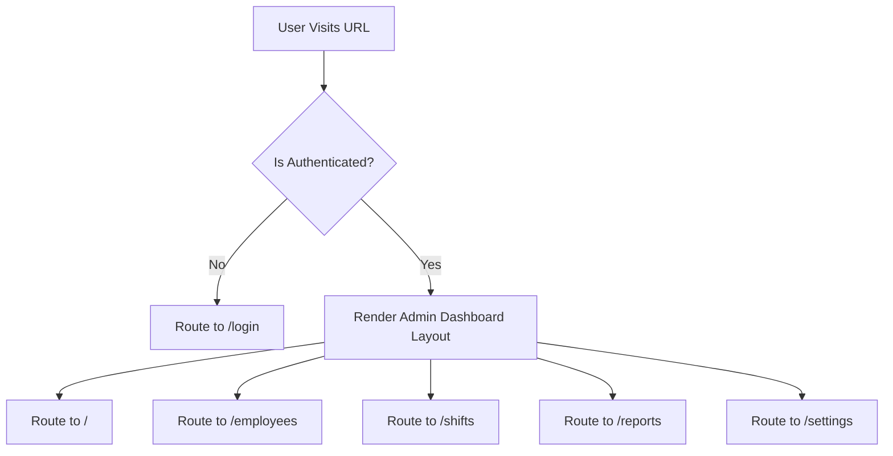

# Admin Dashboard Specification

This document details the screens, layouts, component tree, and routing rules for the React-based **Admin Dashboard**.

---

## 1. User Interface Layout & Screens

The Admin Dashboard provides a web interface for managing employee data, shifts, and reports. It is built using Material UI (MUI v5).

```
┌───────────────────────────────────────────────────────────────┐
│                     ADMIN DASHBOARD SHELL                     │
├───────────┬───────────────────────────────────────────────────┤
│  Sidebar  │                   MAIN CONTENT                    │
│           │                                                   │
│ • Home    │   ┌───────────────┐ ┌───────────────┐ ┌─────────┐ │
│ • Staff   │   │  Present: 42  │ │   Late: 3     │ │ Absent:2│ │
│ • Shifts  │   └───────────────┘ └───────────────┘ └─────────┘ │
│ • Reports │                                                   │
│ • Settings│   [ Attendance Trend Chart - Last 30 Days ]        │
└───────────┴───────────────────────────────────────────────────┘
```

### 1.1 Home Dashboard
* **Purpose**: Overview of the day's attendance metrics.
* **Key Metrics**: Display cards showing total active employees, checked-in count, late arrivals, and absent staff.
* **Data Visualization**:
  * Bar charts comparing attendance rates across departments.
  * Line graphs showing check-in distributions throughout the morning.

### 1.2 Employee Management Screen
* **Purpose**: CRUD operations and face enrollment status monitoring.
* **Data Table**: Features pagination, sorting, search filters, and status toggles.
* **Enrollment Status**: Visual badges indicating whether face profiles are successfully registered.

### 1.3 Shift & Roster Configuration Screen
* **Purpose**: Setting up work shifts and assigning schedules.
* **Calendar View**: Drag-and-drop interface for mapping employees to shifts.

### 1.4 Reports & Analytics Screen
* **Purpose**: Querying and exporting historical data.
* **Filters**: Date range selectors, department filters, and status filters.
* **Export Actions**: Quick buttons to export data to CSV, Excel, or PDF formats.

---

## 2. Navigation & Protected Routing

The application uses React Router to protect admin routes:



* **Public Route**: `/login` (accessible to unauthenticated users).
* **Protected Routes**: `/`, `/employees`, `/shifts`, `/reports`, `/settings` (require a valid JWT access token stored in the auth context). If the token is missing or expired, the user is redirected to `/login`.

---

## 3. API Integration & State Management

* **Axios Client**: Configured with a request interceptor to automatically inject bearer tokens:
  ```javascript
  axios.interceptors.request.use((config) => {
    const token = localStorage.getItem('access_token');
    if (token) {
      config.headers.Authorization = `Bearer ${token}`;
    }
    return config;
  });
  ```
* **React Context API**: Manages global state, including authentication states, active notifications, and system settings.

For details on the report generation engine and export parameters, refer to [10_REPORTS.md](10_REPORTS.md).
