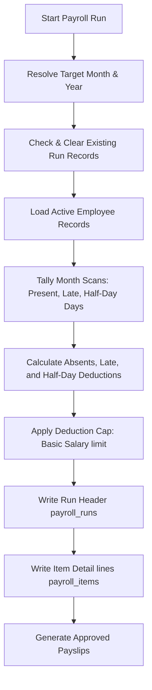

# PSNF Payroll System: Comprehensive Guide

This document provides a detailed overview of the core architecture, rules, schemas, and workflows of the PSNF Payroll Management System. The system manages salary calculations dynamically linked to employee attendance logs, shifts, and leaves.

---

## 1. System Entities & Database Schemas

The payroll engine integrates database tables storing configurations, employee records, and monthly run outputs.

### Employee Salary Configuration (`employees` & `salary_structures`)
* **Basic Salary**: Configured on each employee record (`employees.salary_basic`, default: `35000.00`).
* **Shift Settings**: Custom start limits (`employees.min_clock_in` and `employees.max_clock_out`) are linked to check-in rules.

### Shift & Deduction Policy Templates (`shift_templates`)
The global policies are configured under `shift_templates` (where `id = 1` acts as the master record):
* **Start Time**: The global start hour (default: `09:00:00`).
* **Grace Minutes**: Allowed margin before check-in is considered late (default: `15 minutes`).
* **Late Count Limit**: The number of late scans permitted before penalties are enforced (default: `3`).
* **Late Penalty Percent**: Percentage of basic salary deducted when the late limit is breached (default: `10.00%`).
* **Half-Day Margin**: Time after which attendance is categorized as a half-day (default: `12:00:00` or custom shift start + 3 hours).
* **Half-Day Penalty Percent**: Percentage of a single day's pay deducted per half-day scan (default: `50.00%`).
* **Working Days Map**: A JSON mapping representing customized working day counts per month (`working_days_json`).

### Execution Records (`payroll_runs` & `payroll_items`)
* **`payroll_runs`**: Records summary statistics for a processed month:
  * `month_year` (e.g. "August 2026")
  * `total_gross`, `total_deductions`, `total_net`
  * `status` (e.g. `approved`)
* **`payroll_items`**: Linked items storing individual employee payouts:
  * `gross_salary`, `net_salary`
  * `present_days`, `working_days`
  * `late_deduction`, `absent_deduction` (which bundles full absents + half-days)

---

## 2. Salary Deductions & Rules

Salary payouts are calculated dynamically utilizing daily attendance logs from the targeted month.

### 1. Absenteeism Deduction (Full Days Missed)
* **Monthly Working Days**: Resolved from the month-by-month JSON configuration in `shift_templates`. If not configured, it dynamically calculates working days by counting all non-Sunday calendar days in the month.
* **Per-Day Salary Rate**: `Per-Day Salary = Basic Salary / Monthly Working Days`
* **Total Absent Days**: `Working Days - Present Days` (where Present Days count face recognition scans and manual check-ins).
* **Deduction Calculation**: `Absent Deduction = Absent Days * Per-Day Salary Rate`

### 2. Late Clock-In Deduction
* Evaluates scan logs against the employee's shift start time (`min_clock_in` or global template default) + grace minutes limit.
* Tracks the total number of late check-ins during the month.
* **Penalty Trigger**: If the number of late check-ins matches or exceeds the `Late Count Limit` (typically `3` times), a penalty is applied.
* **Deduction Calculation**: `Late Deduction = Basic Salary * (Late Penalty Percent / 100)`

### 3. Half-Day Deduction
* Evaluates scan logs against the half-day threshold (calculated as custom shift start + 3 hours, or global template default `12:00:00`).
* Tracks the total number of half-day instances.
* **Deduction Calculation**: `Half-Day Deduction = Per-Day Salary Rate * (Half-Day Penalty Percent / 100) * Half-Day Count`

### 4. Cap on Total Deductions
* To ensure legal compliance and avoid negative payouts, total employee deductions (absenteeism + late penalty + half-day penalty) are capped at the employee's base basic salary:
  `Total Deductions = min(Basic Deductions + Late Penalty + Half-Day Penalty, Basic Salary)`
* **Net Salary**: `Net Salary = Basic Salary - Total Deductions`

---

## 3. Payroll Execution Workflow

Processing payroll is a centralized, dynamic action triggered monthly by HR admins.

### Step 1: Initialization & Validation
* Admin inputs target month (e.g. `2026-08`).
* If a payroll run has already been executed for this month, the system automatically deletes the old item details and runs records to avoid duplicate generation.

### Step 2: Custom Shift Resolution
* For each employee, the system checks whether their record contains a custom `min_clock_in` start hour.
* Custom shift rules are applied to scan check-ins, determining late/half-day classifications. Otherwise, it defaults to the global template start.

### Step 3: Database Writes
* Creates a transaction block in `payroll_runs` and individual lines in `payroll_items`.
* Payout statuses default to `approved`.

---

## 4. Payslips & Staff Reports

Employees and admins can view payment breakdowns inside their workspaces.

* **Detailed Details View**: `/staff/payroll/{id}` displays a tabular grid of all processed employees showing gross salary, present days, deductions, and final net payouts.
* **Payslip Render**: `/staff/payroll/{id}/payslip/{empId}` generates a printable payslip matching standard formats. It shows basic credentials, joining date, department, designation, and itemized additions/deductions.
