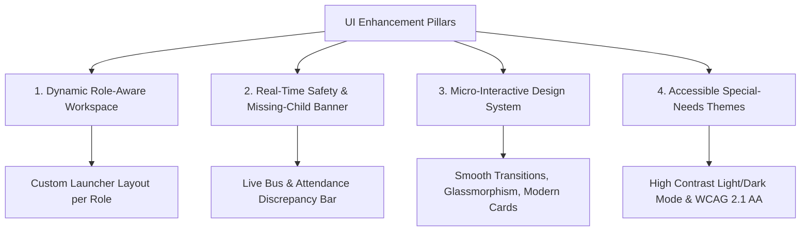

# UI Enhancement & Recommendations Specification

This document details the complete **UI Strategy & Enhancement Plan** for the **PSNF ERP Dashboard** in compliance with role specifications, user access boundaries, and high-impact visual design standards.

---

## 1. Core UI Architecture Strategy

To transform the PSNF Dashboard into a state-of-the-art, role-tailored platform, the UI will adhere to 4 core pillars:



---

## 2. Priority UI Enhancements by Role

### 2.1 Super Admin & School Admin
* **Role Dashboard Launcher:**
  - Executive Multi-Branch Overview cards with real-time KPI metrics (Active Students, Staff on Duty, Buses in Transit, Open Alerts).
  - Quick action floating bar: "Enroll Student", "Issue Certificate", "Emergency Broadcast".
* **Visual Styling:**
  - Rich dark glassmorphism default theme with vibrant indigo/purple gradients (`#6366f1` to `#a855f7`).
  - Interactive charts (Chart.js / ApexCharts) showing attendance trends, IEP progress rates, and fuel consumption.

### 2.2 Teacher & Special Educator
* **Workspace Focus:**
  - **Classroom Quick-Mark Kiosk:** Large, touch-friendly avatar cards for student attendance (One-tap: Present, Absent, Medical Room, Bus Late).
  - **IEP Goal Tracker Widget:** Visual progress rings (0% to 100%) for each cognitive and physical milestone.
  - **Game Analytics Cards:** Instant visual charts displaying game scores and cognitive error trends for assigned students.

### 2.3 Parents & Guardians Portal
* **Parent-Centric Design:**
  - **Child Switcher Header:** Seamlessly toggle between linked children if a parent has multiple children enrolled.
  - **Live Transport Radar:** Dedicated map view showing bus location, estimated arrival time (ETA), driver details, and speed indicator.
  - **Daily Activity Timeline:** Live feed showing "Boarded Bus (7:45 AM)", "Class Check-in (8:15 AM)", "Medication Administered (11:00 AM)", "IEP Milestone Achieved (2:00 PM)".

### 2.4 Transport Driver App Interface
* **Driver-First Mobile UX:**
  - Ultra-simplified high-contrast touch interface with extra-large tap zones for mobile devices inside buses.
  - One-tap boarding list with student photos.
  - Emergency Speed & Geofence HUD warning indicator (>50 km/h turns header amber/red).

---

## 3. Dedicated Safety UI Component: Missing-Child Alert Banner

A key requirement of the PSNF platform is child safety reconciliation. When a discrepancy occurs between bus boarding and classroom attendance, a top-level alert widget will render across Admin, Manager, and Teacher screens:

```
+-----------------------------------------------------------------------------------------+
| [!] CRITICAL RECONCILIATION ALERT: Student "Shiv Patel" boarded Bus #02 (Route A)      |
|     at 07:45 AM but has NOT been marked present in Class 3-B. (15 mins past arrival)    |
|     [ Call Driver ]  [ Contact Parent ]  [ Mark Located & Dismiss ]                     |
+-----------------------------------------------------------------------------------------+
```

---

## 4. UI System Specifications

### Color Palette System
* **Brand Primary:** `#4f46e5` (Indigo-600) / `#6366f1` (Indigo-500)
* **Accent Purple:** `#9333ea` (Purple-600) / `#a855f7` (Purple-500)
* **Emerald Success:** `#059669` (Emerald-600)
* **Amber Warning:** `#d97706` (Amber-600)
* **Rose Emergency:** `#e11d48` (Rose-600)
* **Dark Surface:** `#080d1a` (Surface-950) / `#0f172a` (Slate-900)

### Design & Micro-Animation Details
- **Card Hover Effects:** Subtle scale transformation (`scale(1.02)`), ambient outer glow (`box-shadow: 0 10px 25px -5px rgba(99, 102, 241, 0.25)`).
- **Navigation Transitions:** Smooth sidebar collapse/expand using Alpine.js state transition bindings.
- **Micro-Badges:** Rounded pills with semi-transparent background overlays and crisp borders.

---

## 5. Implementation Roadmap
1. **Refactor Launcher Cards:** Update the main `/dashboard` launcher grid to enforce exact role visibility and modern card styling.
2. **Implement Missing-Child Banner:** Add dynamic reconciliation check in the main layout (`app.php`) to show safety alerts.
3. **Enhance Kiosk & Attendance UI:** Add avatar-based attendance marking controls for teachers.
4. **Standardize Light/Dark Mode:** Ensure high-contrast parity across light and dark modes in all views.
