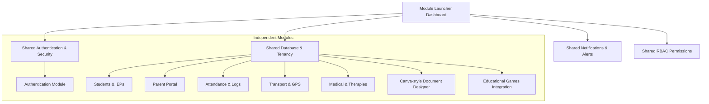

# Vision & Mission

## Mission Statement
To empower NGO-operated special-needs schools with a state-of-the-art, modular ERP platform that simplifies operations, ensures transport safety, digitizes medical logs, integrates educational play, and bridges the communication gap between educators and parents. We aim to reduce administrative burdens so that schools can focus on providing tailored support and therapy for students with diverse cognitive and physical needs.

## Vision Statement
To establish the open-source gold standard for special education management, building a flexible, Odoo-inspired ecosystem where modules can be launched independently, while maintaining a secure, shared, and audit-compliant core database structure.

---

# Core Architecture

The platform follows an **Odoo-inspired model** optimized for local deployment (XAMPP/MySQL) but ready for cloud hosting.

### Key Architectural Pillars:
1. **Module Launcher Dashboard:** A dynamic visual interface containing launchers for verified applications based on permissions.
2. **Module Independence:** Each module handles its own view interfaces, layouts, and logic. If one module experiences issues, the rest of the ERP system remains operational.
3. **Shared core services:** Security rules, tokenized session management, tenant scoping, database access services, and event emission.

---

# Primary User Personas

| Role | Responsibilities | Key Pain Points | Core Workflows in ERP |
|---|---|---|---|
| **Super Admin** | Platform configuration, school registration, global audit trail monitoring. | Multi-tenant resource isolation and system load spikes. | Provisioning new schools, managing global settings tables, inspecting global access controls. |
| **School Admin** | School-specific settings, user onboarding, database backups, transport routing, and permissions assignments. | Complex configurations and security control leaks. | Managing staff assignments, tweaking access constraints, and configuring local settings (such as time locks). |
| **Manager** | Overseeing HR, leave requests, payroll processing, and fee collections. | Manual calculation errors and document tracking delays. | Approving leaves, running payroll calculations, generating receipts via the document designer. |
| **Teacher** | Conducting student classroom attendance, lesson schedules, grading, and IEP updates. | Heavy paperwork detracting from actual teaching. | Updating student disability records, logging class attendance, reporting progress, and scheduling educational game slots. |
| **Staff (Therapist/Care)** | Managing individual therapy logs, medical checks, and file updates. | Communication lag with teachers and parents regarding care needs. | Updating student medical records, uploading progress sheets, and logging incident notes. |
| **Driver** | Daily transport loops, student check-in/check-out during transport, and route navigation. | Ensuring student safety, speed warnings, and parent updates. | Utilizing a mobile-friendly tracking page to start loops, check in students on arrival, and trigger alerts. |
| **Parent** | Student status tracking, tracking bus locations, viewing progress reports, and communicating. | Lack of visibility into medical events, child progress, or transport safety. | Checking real-time GPS tracking on a secure portal, reading announcements, and reviewing child's game scores. |
| **Student** | Interacting with educational games under guidance. | Standard school systems are too visually complex or inaccessible. | Launching HTML5 visual learning modules (e.g., money counting, safe-vs-unsafe, sentence-builder). |

---

# Core Principles

1. **Strict Multi-School Support (Tenancy):**
   Every database table must contain a `school_id` and a `branch_id`. Queries must run through a tenant-filtering service to prevent data leakage.
2. **Auditability (No Hard Deletes):**
   No database rows can be deleted using `DELETE`. Use soft-delete markers (`deleted_at`). Audit logs must capture the operator's IP, browser user-agent, and the altered data payload.
3. **Local-First with Cloud Options:**
   Performant offline/local networks on XAMPP installations with automatic cloud synchronization engines when internet availability is restored.
4. **Mobile & Device Responsive UI:**
   All screens must be responsive. Custom device blocking settings (e.g., block mobile access for staff outside specified hours) are configured directly from the admin panel.
5. **Accessibility-First Design:**
   UI elements must support cognitive and physical accommodations, offering high contrast toggles, screen-reader markup, keyboard-only shortcuts, and simplified visual flows.

---

# Special Needs Features & Document Engine

### Specialty Care & Disability Records
* Detailed profile tracking for individual cognitive and physical disabilities.
* Multi-therapist progress logging, including speech, occupational, and behavioral therapy.
* Daily Individualized Education Program (IEP) progress updates.

### Secure File & Document System
A Canva-style web editor with drag-and-drop capability to create templates for certificates, ID cards, and letters.
* **Bulk Generation:** Automate mapping student and parent database fields onto templates to output printable PDF books.
* **Security Controls:** Stream files via core controller mechanisms, enforce dynamic watermarks, block screenshots/PDF downloads for restricted staff, and incorporate unique verification QR codes.

