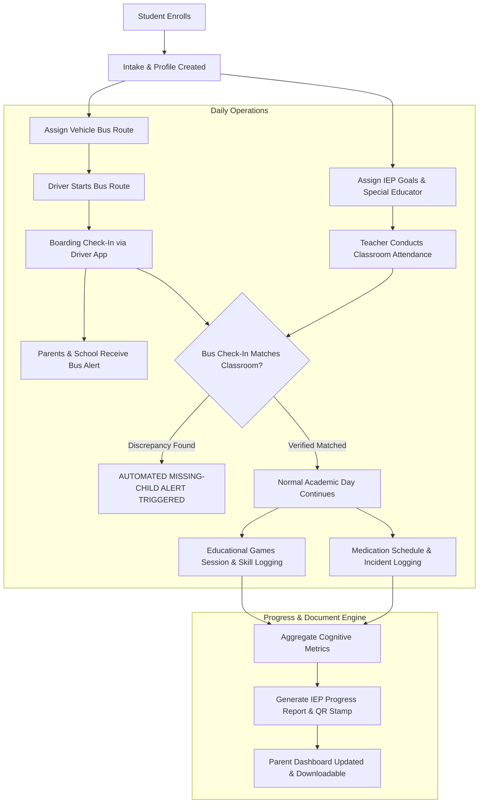

# PSNF Dashboard Workflow & Access Control Specifications

## Executive Overview
The **PSNF ERP Platform** (specifically designed for NGO-operated special-needs schools) manages sensitive student data, individualized education programs (IEPs), medical logs, real-time transportation, games logging, staff payroll, and document generation. 

This document defines:
1. **User Persona Architecture & Role Matrix**
2. **Module-by-Module Access & Visibility Control Matrix**
3. **End-to-End Operational Workflows**
4. **Security & Data Protection Directives**

---

## 1. User Personas & Role Matrix

| Role | Role Code | Scope / Context | Description |
| :--- | :--- | :--- | :--- |
| **Super Admin** | `super_admin` | Multi-School / Global System | Full unconstrained control over system configuration, school branches, role permissions, databases, and global logs. |
| **School Admin** | `school_admin` | Single School Branch | Full management of assigned school branch (students, staff, timetables, finances, transport, and approvals). |
| **School Manager** | `manager` | School Branch Operations | Focuses on day-to-day administrative operations, leave approvals, transport oversight, and audit monitoring. |
| **Teacher / Special Educator** | `teacher` | Assigned Classes & IEP Students | Manages class attendance, student IEP goals, game scores, grades, and clinical incident reporting. |
| **Staff / Support Staff** | `staff` | Operational / Support Tasks | Non-teaching support staff (nurses, assistants) handling medical logs, general attendance, or resource entry. |
| **Transport Driver** | `driver` | Assigned Vehicle / Bus Route | Operates driver app; records student bus boarding/drop-off and streams real-time GPS locations. |
| **Parent / Guardian** | `parent` | Linked Child(ren) | Accesses dedicated Parent Portal to monitor bus live location, attendance, IEP progress, medical alerts, and game achievements. |
| **Student** | `student` | Personal Learning Profile | Accesses simplified learning interface, educational games, and timetable (with restricted view). |

---

## 2. Module & Page Access Control Matrix

### View & Action Legend
* **Full (F):** Create, Read, Update, Delete, Export, Approve.
* **Read-Only (R):** View allowed assigned data; cannot edit, delete, or create.
* **Partial (P):** Context-restricted operations (e.g. edit own profile, log assigned class only).
* **None (N):** Page hidden; route blocked with `403 Forbidden`.

| Module & Pages | Super Admin | School Admin | Manager | Teacher | Staff | Driver | Parent | Student |
| :--- | :---: | :---: | :---: | :---: | :---: | :---: | :---: | :---: |
| **1. Executive Dashboard** |
| - Global Multi-Branch Metrics | F | N | N | N | N | N | N | N |
| - School Overview Dashboard | F | F | F | R | R | N | N | N |
| - Parent / Student Dashboard | N | N | N | N | N | N | F | R |
| - Driver Operational Dashboard | N | N | N | N | N | F | N | N |
| **2. Role & User Management** |
| - System Roles & Permissions Matrix | F | R | N | N | N | N | N | N |
| - Staff & User Accounts Management | F | F | P (Read/Add) | N | N | N | N | N |
| **3. Student & IEP Management** |
| - Student Directory & Profiles | F | F | F | P (Assigned) | R | N | P (Child) | P (Self) |
| - Admissions & Intake Workflow | F | F | F | N | N | N | N | N |
| - IEP Creation & Milestone Tracking | F | F | F | F | R | N | R | R |
| **4. Attendance & Missing-Child Alerts** |
| - Daily Classroom Attendance | F | F | F | F (Class) | P | N | R (Child) | N |
| - Bus Transport Attendance | F | F | F | R | N | F (Route) | R (Child) | N |
| - Missing-Child Reconciliation Alerts | F | F | F | F | F | F | R (Alert) | N |
| **5. Transport & GPS Live Tracking** |
| - Fleet & Vehicle Management | F | F | F | N | N | N | N | N |
| - Route & Geofence Configuration | F | F | F | N | N | N | N | N |
| - Live GPS Bus Map | F | F | F | R | R | F (Current) | F (Assigned)| N |
| - Speed Violation & Safety Alerts | F | F | F | N | N | R | N | N |
| **6. Medical Logs & Clinical Incidents** |
| - Daily Medication Administration | F | F | F | R | F (Nurse) | N | R (Child) | N |
| - Clinical Incident Reports | F | F | F | F | F | N | R (Alert) | N |
| **7. Timetables & Examinations** |
| - Master Timetable Scheduling | F | F | F | R | N | N | R | R |
| - Adaptive Grading & Report Cards | F | F | F | F | N | N | R (Child) | R (Self) |
| **8. HR, Leaves & Payroll** |
| - Staff Leave Applications | F | F | F (Approve) | P (Apply) | P (Apply)| N | N | N |
| - Payroll & Salary Slips | F | F | R | N | N | N | N | N |
| **9. Educational Games Analytics** |
| - Game Progress & Error Analytics | F | F | F | F | R | N | R (Child) | F (Play) |
| **10. Canvas Document Engine** |
| - Template Designer & SQL Binding | F | F | R | N | N | N | N | N |
| - Batch Document Print & QR Verification| F | F | F | P | P | N | N | N |

---

## 3. End-to-End Operational Workflows

### Key Workflow Rules:
1. **Safety Reconciliation Protocol:** If a student boards the bus (`Bus Check-In = True`) but is NOT marked present in class within 30 minutes of bus arrival, a high-priority system alert immediately notifies School Admin, Manager, Class Teacher, and Parent.
2. **Medical Double-Signoff:** Administering scheduled medication requires nurse logging and second-staff verification before parent notification is dispatched.
3. **DRM & Access Time Restriction:** Staff accounts are dynamically locked outside operating hours (e.g. 7 PM to 6 AM) unless overridden by Super Admin. Screen capture/printing shortcuts (`CTRL+P`, `PrintScreen`) are disabled on sensitive views.

---

## 4. Immediate Dashboard Implementation & Fix Strategy
To align the existing codebase with these specifications, the following tasks must be completed:
1. **Database Role Schema Synchronization:** Ensure database seeds and role middleware map strictly to the 8 defined roles.
2. **Dashboard Route Guarding:** Secure UI menu items and routes so users only see their authorized modules.
3. **Module View Refactoring:** Refactor dashboard templates to hide unauthorized cards, navigation links, and action buttons dynamically.
